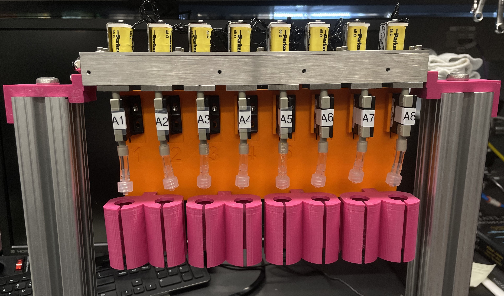
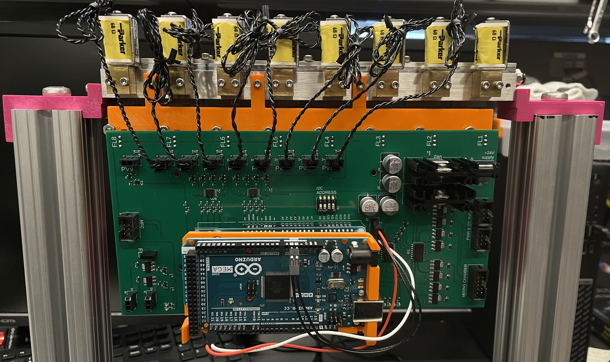

# 8-line Olfactometer Hardware

<!-- 
## image tests
-->

<!--
# this only shows the text
-->

  
  
  

<!--
# just gives blank images

  
  

 

 
-->

## Parts to be manufactured
to make a single 8-line unit:
- (x1) top_cover
- (x1) main_manifold_8v
- (x8) main_manifold_cover

 

## Updates for version 2:
- **main manifold:** mounting holes for main plate on both sides
- **main manifold cover:** 0.01" decrease in length (screw holes are now symmetric)