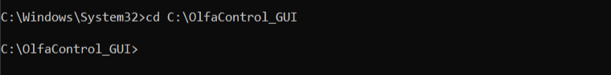
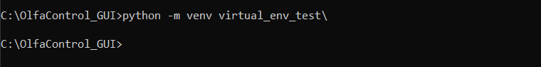
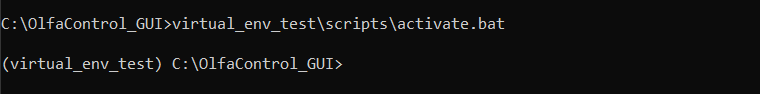

## Creating a virtual environment:

A virtual environment is a space separate from your main python install, where you can install just the packages needed for this project (without affecting your global python packages).  

It's not necessary to create one in order to use this GUI, but if you choose to, don't forget to activate it **each time** before running the GUI, or it may not run properly.  
<br>

1. Open the command prompt and navigate to the directory where you want the environment created. (For this circumstance, you'll probably want that to be the folder that these files are stored in, "OlfaControl_GUI".)  

    

2. Create the environment:  
    ``` python -m venv <name of environment>\ ```  
    
    To create an environment using a specific python version:  
    ``` <path to python version> -m venv <name of environment>\ ```  
    
    

3. Activate the virtual environment:  
    ```<name of environment>\scripts\activate.bat```
    
    

Once in the environment, you'll have access to all of the packages specifically installed there.