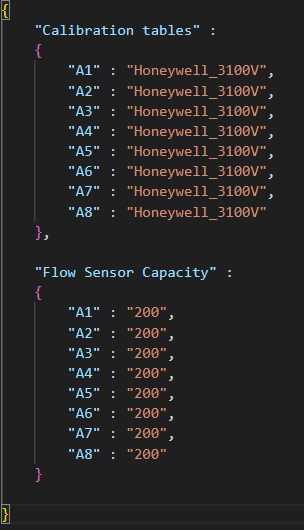
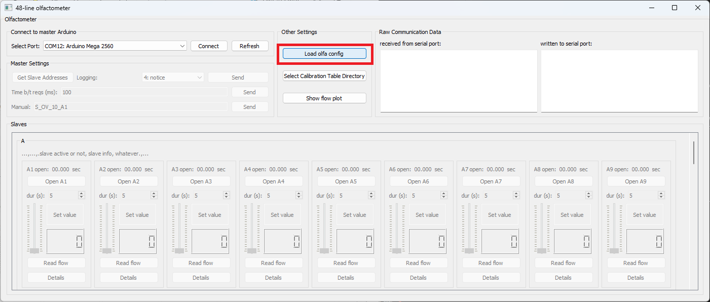
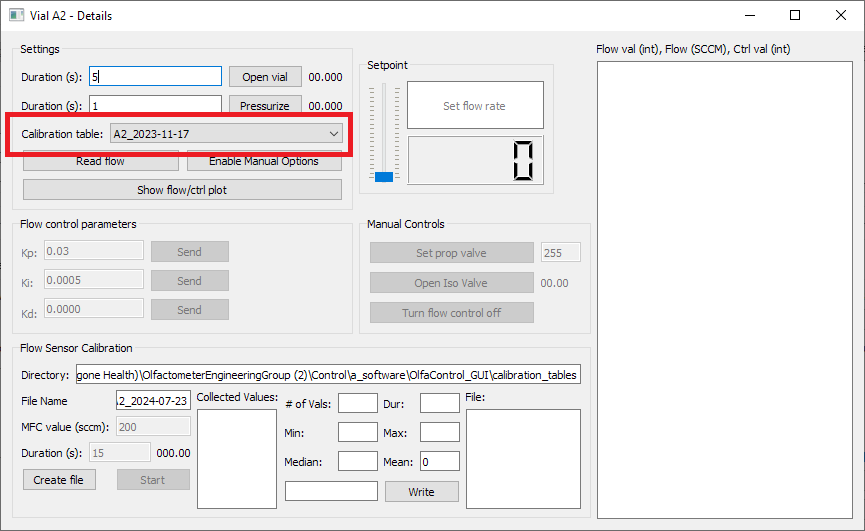

## Calibration tables & Config files
### Calibration tables

To read from each flow sensor, the GUI uses a calibration table to convert the data from voltage to flow rate.  

 

Each flow sensor has a slightly different calibration, so it is recommended to use the calibration table specific to each individual sensor to ensure accurate flow control. (Further information on calibrating flow sensors can be found [here](Resources/flow_sensor_calibration.md).  

***Note:*** Calibration tables need to be in a folder called **calibration_tables** within the OlfaControl_GUI folder.  
### Config files

To easily load these calibration tables into the GUI, you can use a config file that lists the miniMFCs on your olfactometer and their corresponding calibration tables.  

This allows for quickly loading all calibration tables into the GUI all at once (as opposed to manually entering them into the Vial Details box for each line).  
*
 *Example config file:*  
*

 

With the GUI open, click "Load config file" and select the config file. (This must be done each time the GUI is closed and reopened.)  

To confirm that the config file loaded correctly, open up one of the Vial Details boxes and check that the intended calibration table for that miniMFC is selected.  
