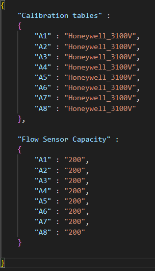

# 8-line Olfactometer + Mixing Chamber

<!--## Full System Overview-->
## Overview

<p align="center"></p>

description of basically how the system works
what it is - olfactometer + mixing chamber, multi-odor, etc

basic schematic of the thing

<!--

<br>

<p align="center"></p>
<br>

### Simplified:

<p align="center">
  
  
</p>
-->

## Getting Started

<!--### Software Installation-->
### GUI Install

**Python versions**: As of 4/29/2024: GUI is currently compatible with Python 3.9, 3.10, 3.12  

1. Download/clone the GUI at [OlfaControl_GUI](https://github.com/tooles01/OlfaControl_GUI/tree/shannon-branch).
    - It is highly recommended to do so via [Github Desktop](https://docs.github.com/en/desktop/installing-and-authenticating-to-github-desktop/installing-github-desktop) in order to pull new commits (bug fixes/updates) in real time.
    - If not using GitHub Desktop:
        - Click the green "<>Code" button above
        - Click "Download ZIP"
        - Save the folder to a directory on your computer.
2. Open the command prompt and navigate to the directory the folder is stored in.
3. *Optional:* Create & activate a [virtual environment](Resources\virtual_environment.md)
4. Install the required packages by entering: ``` pip install -r requirements.txt ``` into the command prompt.
5. Run the GUI: ```python olfa_driver_48line.py```  
    (Big Program for running automated stuff/adding PID: ```python main.py```)  
<br>


### Hardware setup

Need 1000cc input air (Alicat) (& corresponding power/control cables)

- Arduino cable to connect to computer
- 24V power to connect to PCB
<br>


## Quick Start

1. Activate virtual environment  
2. Run GUI: `python olfa_driver_48line.py`  
3. Connect to Arduino  
4. Load config file  
5. Optional: Connect to ZMQ server  

## Updating

Update GUI by pulling latest version from the Github.

## Troubleshooting

Go to the [troubleshooting](Resources\troubleshooting.md) page.


## Calibration tables & Config files
### Calibration tables

To read from each flow sensor, the GUI uses a calibration table to convert the data from voltage to flow rate.  
<p align="center"> </p>

Each flow sensor has a slightly different calibration, so it is recommended to use the calibration table specific to each individual sensor to ensure accurate flow control. (Further information on calibrating flow sensors can be found [here](Resources/flow_sensor_calibration.md).  

***Note:*** Calibration tables need to be in a folder called **calibration_tables** within the OlfaControl_GUI folder.  
### Config files

To easily load these calibration tables into the GUI, you can use a config file that lists the miniMFCs on your olfactometer and their corresponding calibration tables.  

This allows for quickly loading all calibration tables into the GUI all at once (as opposed to manually entering them into the Vial Details box for each line).  
*<p align="center"> *Example config file:*  </p>*
<p align="center"> </p>

With the GUI open, click "Load config file" and select the config file. (This must be done each time the GUI is closed and reopened.)  


To confirm that the config file loaded correctly, open up one of the Vial Details boxes and check that the intended calibration table for that miniMFC is selected.  
