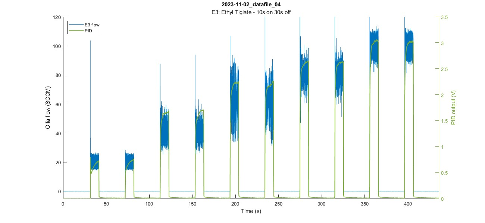

# MATLAB scripts for plotting/data analysis

**Analyze datafiles (created by running main.py) using the MATLAB scripts found at [OlfaControl_GUI\analysis](https://github.com/tooles01/OlfaControl_GUI/tree/shannon-branch/analysis).**  

Best practice is to download/clone the entire folder, ["analysis/functions"](https://github.com/tooles01/OlfaControl_GUI/tree/shannon-branch/analysis/functions) contains the dependencies for the plotting scripts (they will not run without those functions).

**Note**: When running functions, MATLAB directory must be "...\OlfaControlGUI\analysis"  
(*import_datafile.m* will not run otherwise)  
 

## To load data files:
### analysis_get_and_parse_files.m
Gets raw \*.csv datafile and save as \*.mat file.  
#### Description:
- **Loads \*.csv datafile** from *OlfaControl_GUI\result_files\48-line olfa*  
- **Saves raw file** to *OlfaControl_GUI\analysis\data files (raw)*  
- **Parses file**, converts units, creates data structures, etc  
- **Saves parsed file** to *OlfaControl_GUI\analysis\data (.mat files)*  

**Note:** User must enter datafile name (line 57ish)

**More details [here](https://github.com/tooles01/OlfaControl_GUI/blob/shannon-branch/analysis/Documentation/README_analysis_get_and_parse_files.md)**  
 

## Plotting:

### a_plot_olfa_and_pid.m
**Plots olfactometer & PID data over time**  

**Syntax**  
`a_plot_olfa_and_pid(a_thisfile_name)` creates a plot of the data in the given file over time.  
`a_plot_olfa_and_pid(a_thisfile_name,plot_opts)` specifies the plot options.  

**Example:**  
`a_plot_olfa_and_pid('2023-11-02_datafile_04',pid_lims=[0 3.5]);`  
Plots datafile "2023-11-02_datafile_04" with PID (Y-axis) limits set from 0 to 3.5.

**More details [here](https://github.com/tooles01/OlfaControl_GUI/blob/shannon-branch/analysis/Documentation/README_a_plot_olfa_and_pid.md)**  

### a_plot_spt_char.m
**Plots setpoint characterization of trial** (Flow v. PID plot)  

**Syntax**  
`a_plot_spt_char(filename)` plots the setpoint characterization figure (flow vs. PID) of the given file.  
`a_plot_spt_char(filename,plot_opts)` plots the setpoint characterization figure (flow vs. PID) of the given file using the additional plot options specified.  

**Example:**  
`a_plot_spt_char('2024-01-09_datafile_01');`

**More details [here](https://github.com/tooles01/OlfaControl_GUI/blob/shannon-branch/analysis/Documentation/README_a_plot_spt_char.md)**  

### a_plot_on_top
**Plots a bunch of files on top of each other**

**Syntax**  
`a_plot_on_top(file_names,a_title,a_subtitle)` plots the files in the array `file_names`  

**More details [here](https://github.com/tooles01/OlfaControl_GUI/blob/shannon-branch/analysis/Documentation/README_a_plot_on_top.md)**

### analysis_plot_standard_olfa.m
**Plots file from standard olfactometer**

**Description:**  
--> Loads \*.csv file (from *OlfaControl_GUI\results_files\standard olfa*)  
--> Parses file & saves to *OlfaControl_GUI\analysis\data (.mat files)*  
--> Plots the setpoint characterization figure  

**More details [here](https://github.com/tooles01/OlfaControl_GUI/blob/shannon-branch/analysis/Documentation/README_plot_standard_olfa.md)**  