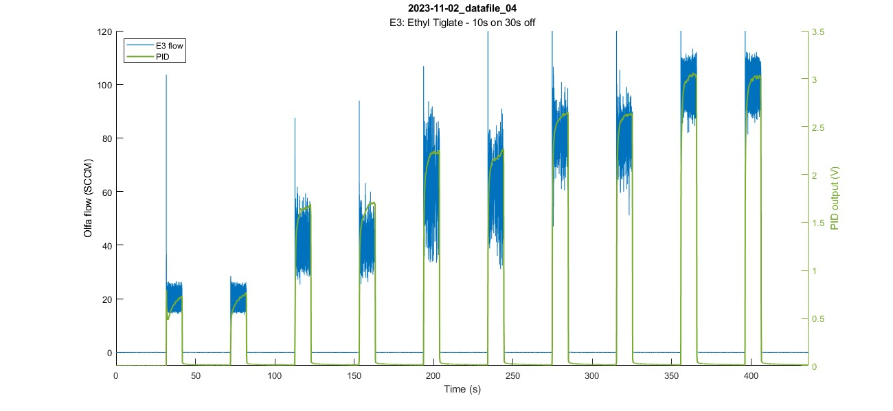
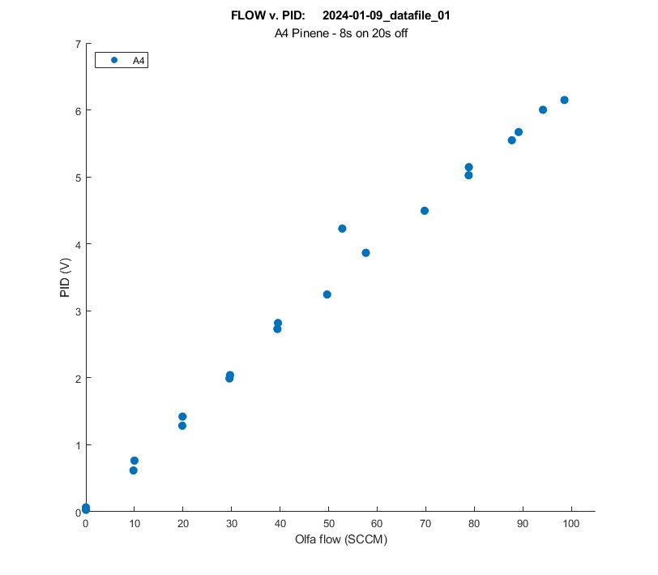

# Plotting datafiles

## a_plot_olfa_and_pid.m
**Plots olfactometer & PID data over time**  

**Syntax**  
`a_plot_olfa_and_pid(a_thisfile_name)` creates a plot of the data in the given file over time.  
`a_plot_olfa_and_pid(a_thisfile_name,plot_opts)` specifies the plot options.  

**Example:**  
`a_plot_olfa_and_pid('2023-11-02_datafile_04',pid_lims=[0 3.5]);`  
Plots datafile "2023-11-02_datafile_04" with PID (Y-axis) limits set from 0 to 3.5.

**More details [here](https://github.com/tooles01/OlfaControl_GUI/blob/shannon-branch/analysis/Documentation/README_a_plot_olfa_and_pid.md)**  

## a_plot_spt_char.m
**Plots setpoint characterization of trial** (Flow v. PID plot)  

**Syntax**  
`a_plot_spt_char(filename)` plots the setpoint characterization figure (flow vs. PID) of the given file.  
`a_plot_spt_char(filename,plot_opts)` plots the setpoint characterization figure (flow vs. PID) of the given file using the additional plot options specified.  

**Example:**  
`a_plot_spt_char('2024-01-09_datafile_01');`

**More details [here](https://github.com/tooles01/OlfaControl_GUI/blob/shannon-branch/analysis/Documentation/README_a_plot_spt_char.md)**  

## a_plot_on_top
**Plots a bunch of files on top of each other**

**Syntax**  
`a_plot_on_top(file_names,a_title,a_subtitle)` plots the files in the array `file_names`  

**More details [here](https://github.com/tooles01/OlfaControl_GUI/blob/shannon-branch/analysis/Documentation/README_a_plot_on_top.md)**

## analysis_plot_standard_olfa.m
**Plots file from standard olfactometer**

**Description:**  
--> Loads \*.csv file (from *OlfaControl_GUI\results_files\standard olfa*)  
--> Parses file & saves to *OlfaControl_GUI\analysis\data (.mat files)*  
--> Plots the setpoint characterization figure  

**More details [here](https://github.com/tooles01/OlfaControl_GUI/blob/shannon-branch/analysis/Documentation/README_plot_standard_olfa.md)**  